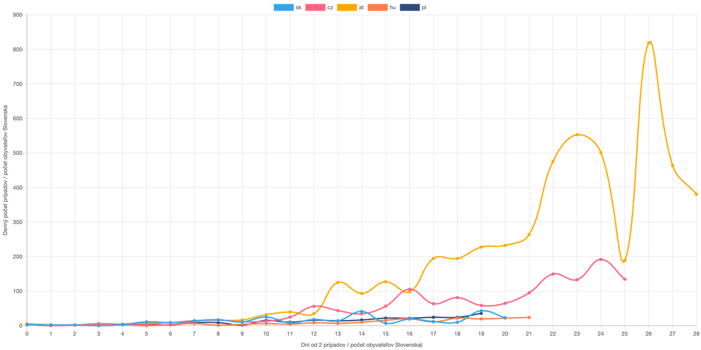

Comparison of COVID-19 in Slovakia and other countries relative to size of Slovak population. Live at https://qsmd.github.io/covid19slovakia



Note: this repo contains submodule for data import. After cloning, run:  

```
git submodule init
git submodule update
cd CSSEGISandData/COVID-19
git checkout master
git pull
```

To import data from submodule run:  

```
python import.py > docs/data/cases.js 
```
